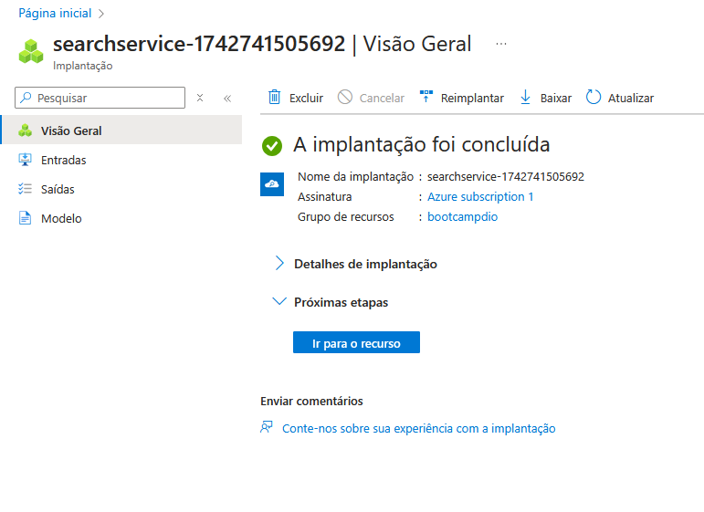

# DIO-DP100#2
Segundo Projeto do Bootcamp DP-100

## Chatbot Baseado em Conteúdo de PDFs | Azure AI

### Cenário

Imagine que você é um estudante de Engenharia de Software, prestes a escrever seu Trabalho de Conclusão de Curso (TCC). Para isso, você precisa revisar e correlacionar diversos artigos científicos. Entretanto, à medida que acumula mais documentos, torna-se cada vez mais difícil extrair informações relevantes e conectar ideias entre diferentes textos.

Diante desse desafio, você decide utilizar inteligência artificial para facilitar esse processo, criando um sistema de busca inteligente capaz de interpretar os PDFs, organizar informações e gerar respostas relevantes com base no conteúdo carregado.

### Início do Projeto

O ponto de partida do projeto residiu na compreensão da estrutura hierárquica e interdependência entre os Grupos de Recursos, Workspaces e Hubs do Azure AI Foundry, elementos cruciais para um desenvolvimento otimizado.

Em termos concisos:

* **Grupo de Recursos:**
    * Consiste em um container lógico no Azure, concebido para a agregação de recursos correlacionados, promovendo, assim, uma gestão simplificada, implantação eficiente e controle de acesso granular.
* **Workspace (Espaço de Trabalho):**
    * Dentro do ecossistema Azure AI, o Workspace figura como um ambiente de colaboração, meticulosamente projetado para a construção, treinamento e implementação de modelos de aprendizado de máquina.
* **Hub do Foundry:**
    * Representa um recurso de nível superior no Azure AI Foundry, exercendo um papel centralizado no controle da segurança, conectividade e recursos computacionais, direcionados a projetos de Inteligência Artificial.

A arquitetura estabelece uma relação de contenção, onde o Grupo de Recursos abriga os Workspaces, e estes, por sua vez, contêm e disponibilizam os serviços do AI Foundry.

### Etapas do Projeto

O processo de criação do chatbot envolveu uma série de etapas, cada uma crucial para o sucesso do projeto:

1.  **Estruturação do Ambiente Azure:**
    * A criação de um Grupo de Recursos no Azure serviu como o alicerce para a organização e gerenciamento de todos os recursos necessários.

    

    * Em seguida, um Workspace foi configurado como o ambiente colaborativo para o desenvolvimento, treinamento e implantação do modelo de aprendizado de máquina.
    * A implementação do Hub do AI Foundry permitiu a centralização do controle de segurança, conectividade e recursos de computação, facilitando a criação de workspaces de projeto.

    

2.  **Desenvolvimento do Chatbot:**
    * A criação do Azure AI Hub e o lançamento do AI Foundry forneceram as ferramentas necessárias para a construção do chatbot.

    

    * Um novo projeto foi criado, e o modelo GPT-4 foi implantado para garantir a capacidade de geração de respostas relevantes.

    

    * O Playground foi utilizado para testar o Chat Playground, permitindo a interação com o modelo e a validação de sua funcionalidade.

    

    * A mensagem inicial do chat, foi configurada para que o bot instrua o usuário a fazer perguntas com base nos arquivos inseridos.

    

    * O upload de arquivos PDF, que seriam a base de conhecimento do chatbot, e a configuração do recurso de pesquisa do Azure AI, para que o modelo pudesse pesquisar e recuperar dados relevantes dos PDFs, para formular as respostas.

    

    * A seleção do serviço de pesquisa do Azure AI criado possibilitou a integração da capacidade de pesquisa ao chatbot.

    

    * Por fim, a utilização do chat demonstrou a eficiência do chatbot em responder a perguntas com base no conteúdo dos PDFs carregados.

3.  **Conclusão:**

    A jornada de desenvolvimento deste projeto proporcionou um aprendizado abrangente e multifacetado, abrangendo desde a familiarização com o ambiente Azure até a implementação de um chatbot inteligente. As principais aquisições de conhecimento incluem:

    * **Domínio do Ambiente Azure:**
    O projeto permitiu uma imersão prática no ecossistema Azure, abrangendo a criação e o gerenciamento de recursos como Grupos de Recursos, Workspaces e Hubs do AI Foundry. Essa experiência consolidou a compreensão da arquitetura do Azure e suas capacidades para o desenvolvimento de soluções de IA.
    
    * **Funcionamento da Busca Vetorial:**
     Um dos aprendizados mais significativos foi a aplicação da busca vetorial para indexar e recuperar informações de arquivos PDF. A compreensão desse mecanismo permitiu a criação de um sistema capaz de extrair dados relevantes de documentos complexos, otimizando a eficiência do chatbot.
    
    * **Criação de Chatbot Inteligente:**
    A experiência prática na criação do chatbot consolidou os conhecimentos sobre o desenvolvimento de interfaces de conversação baseadas em inteligência artificial. Isso incluiu desde a seleção e implantação de modelos de linguagem como o GPT-4 até a integração de funcionalidades de pesquisa e recuperação de informações.

Em resumo, o projeto permitiu a aplicação prática de conceitos teóricos, resultando em um aprendizado significativo sobre o uso do Azure e o desenvolvimento de soluções de IA para o processamento e análise de dados complexos.
